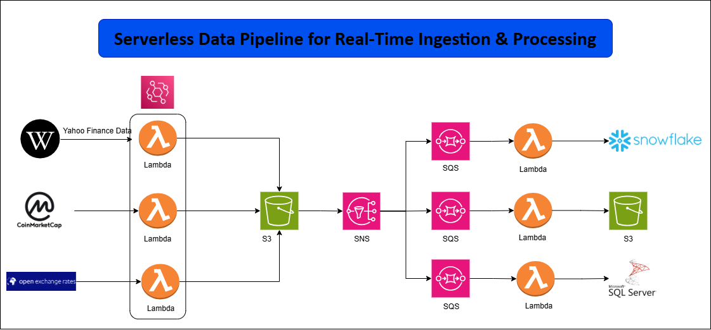
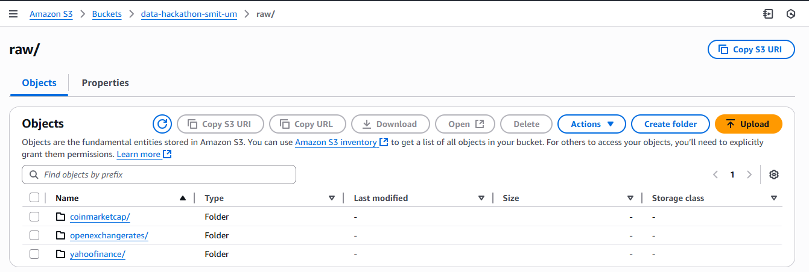
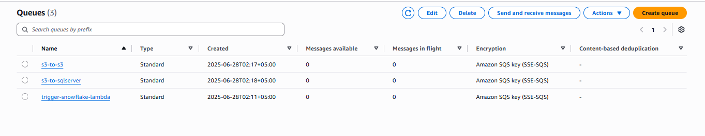
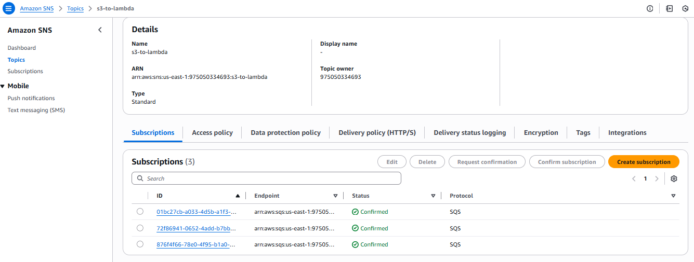

<div align="center">

<h1>🚀 DataPulse: Real-Time Serverless Data Ingestion Pipeline</h1>

<p>
<b>Real-time serverless data ingestion pipeline using AWS Lambda, EventBridge, S3, SQS, SNS, Snowflake, and Python to collect financial, cryptocurrency, and foreign exchange data.</b>
</p>

<p>


</p>

</div>

---



## 📌 Project Overview

**DataPulse** is a real-time serverless data ingestion pipeline that collects data from multiple external financial sources and stores the results in a cloud-based data lake.

The pipeline uses **AWS Lambda** functions triggered by **Amazon EventBridge** rules to fetch data every minute from:

- Yahoo Finance
- CoinMarketCap
- OpenExchangeRates

The collected data is stored in **Amazon S3** using source-based and timestamp-based folder partitions. The project also includes queueing/notification components with **Amazon SQS** and **Amazon SNS**, plus Snowflake SQL and loader code for warehouse loading.

---

## 🎯 Objectives

- Build a real-time serverless data ingestion system
- Fetch stock market data from Yahoo Finance
- Scrape cryptocurrency market data from CoinMarketCap
- Fetch foreign exchange rates from OpenExchangeRates
- Store raw data in Amazon S3 using partitioned paths
- Process CoinMarketCap data into structured CSV output
- Use EventBridge rules to schedule Lambda functions
- Use SQS queues for event-driven processing
- Use SNS topics for pipeline notification
- Prepare ingested data for Snowflake warehouse loading

---

## ⚙️ Lambda Functions

<p align="center">

</p>

The project uses three main fetch Lambda functions:

| Lambda | Purpose |
|---|---|
| `yahooFinance.py` | Fetches minute-level S&P 500 stock data using `yfinance` |
| `CoinMarketCap.py` | Scrapes top cryptocurrency data from CoinMarketCap |
| `openExchangeRates.py` | Fetches real-time currency exchange rates from OpenExchangeRates API |

---

## ⏱️ EventBridge Rules

<p align="center">

</p>

EventBridge rules trigger the ingestion Lambda functions on a schedule, allowing the pipeline to collect fresh data automatically.

Recommended schedule:

```text
rate(1 minute)
```

---

## 🧾 Yahoo Finance Lambda

<p align="center">

</p>

The Yahoo Finance Lambda:

- Scrapes S&P 500 symbols from Wikipedia
- Fetches recent minute-level OHLCV data using `yfinance`
- Adds symbol, source, ingest timestamp, and status columns
- Saves the output CSV file to Amazon S3

---

## 🗂️ S3 Storage

<p align="center">

</p>

Raw and processed files are stored in Amazon S3 using organized source-based paths.

### Example S3 Layout

```text
s3://<S3_BUCKET_NAME>/
│
├── raw/
│   ├── yahoofinance/
│   │   └── YYYY/MM/DD/HHMM.csv
│   │
│   ├── coinmarketcap/
│   │   └── YYYY/MM/DD/HHMM.json
│   │
│   └── openexchangerates/
│       └── YYYY/MM/DD/HHMM.csv
│
└── coinMarketProceedData/
    └── coinmarketcap/
        └── YYYY/MM/DD/HHMM.csv
```

---

## 📬 SQS Queues

<p align="center">

</p>

Amazon SQS can be used to decouple ingestion events from downstream load or processing jobs.

---

## 🔔 SNS Topic

<p align="center">

</p>

Amazon SNS can be used to send notifications when important pipeline events occur.

---

## ❄️ Snowflake Output

<p align="center">

</p>

The project includes Snowflake SQL for creating a table to store stock market data.

Main SQL file:

```text
sql-code/snowflake.sql
```

Example table:

```sql
CREATE TABLE stock_data (
    Datetime TIMESTAMP_TZ,
    Open FLOAT,
    High FLOAT,
    Low FLOAT,
    Close FLOAT,
    Volume INTEGER,
    Dividends FLOAT,
    Stock_Splits FLOAT,
    symbol STRING,
    source STRING,
    ingest_timestamp TIMESTAMP_TZ,
    status STRING
);
```

---

## 🔄 Pipeline Workflow

```text
EventBridge Schedule
        │
        ▼
AWS Lambda Functions
        │
        ├── Yahoo Finance
        ├── CoinMarketCap
        └── OpenExchangeRates
        │
        ▼
Amazon S3 Raw Zone
        │
        ├── raw/yahoofinance/
        ├── raw/coinmarketcap/
        └── raw/openexchangerates/
        │
        ▼
Processing / Queue Layer
        │
        ├── SQS
        ├── SNS
        └── Processed CoinMarketCap CSV
        │
        ▼
Snowflake / Analytics Layer
```

---

## 📁 Project Structure

```text
DataPulse-Real-Time-Serverless-Data-Ingestion-Pipeline/
│
├── Images/
│   ├── Rules To Trigger Lambdas.png
│   ├── Three Lambda Functions.png
│   ├── architecture.png
│   ├── s3-files.png
│   ├── snowflake data.png
│   ├── sns-topic.png
│   ├── sqs-queues.png
│   └── yahoo lambda.png
│
├── output_files/
│   ├── coinMarketProceedData/
│   └── raw/
│       ├── coinmarketcap/
│       ├── openexchangerates/
│       └── yahoofinance/
│
├── python-code/
│   ├── fetch-code/
│   │   ├── CoinMarketCap.py
│   │   ├── openExchangeRates.py
│   │   └── yahooFinance.py
│   │
│   └── load-code/
│       ├── openexchangerates.py
│       └── yahooFinance.py
│
├── sql-code/
│   └── snowflake.sql
│
├── lambda_layer.zip
├── Serverless_Data_Pipeline_Presentation.pptx
├── Serverless_Data_Pipeline_Presentationdsf.pptx
├── 📄 Data Engineering HACKATHON – CASE STUDY DOCUMENT.pdf
├── README.md
├── LICENSE
└── .gitignore
```

---

## 🌍 Data Sources

### 1. Yahoo Finance

| Item | Details |
|---|---|
| Library | `yfinance` |
| Source Symbols | S&P 500 symbols scraped from Wikipedia |
| Data | OHLCV stock market data |
| Output | CSV |
| S3 Path | `raw/yahoofinance/YYYY/MM/DD/HHMM.csv` |

---

### 2. CoinMarketCap

| Item | Details |
|---|---|
| Method | Web scraping |
| Libraries | `requests`, `BeautifulSoup` |
| Data | Top 10 cryptocurrencies |
| Raw Output | JSON |
| Processed Output | CSV |
| S3 Path | `raw/coinmarketcap/YYYY/MM/DD/HHMM.json` |

---

### 3. OpenExchangeRates

| Item | Details |
|---|---|
| Method | API call |
| API | OpenExchangeRates latest rates endpoint |
| Data | Currency exchange rates |
| Output | CSV |
| S3 Path | `raw/openexchangerates/YYYY/MM/DD/HHMM.csv` |

---

## 🧩 Code Overview

### Fetch Code

```text
python-code/fetch-code/
```

| File | Purpose |
|---|---|
| `yahooFinance.py` | Fetches stock price data |
| `CoinMarketCap.py` | Scrapes cryptocurrency data |
| `openExchangeRates.py` | Fetches currency exchange rates |

### Load Code

```text
python-code/load-code/
```

| File | Purpose |
|---|---|
| `yahooFinance.py` | Loads Yahoo Finance CSV data into Snowflake |
| `openexchangerates.py` | Loads OpenExchangeRates CSV data into SQL Server-style target |

> Review and standardize the load target before production use. One load script is Snowflake-oriented while another uses SQL Server connection variables.

---

## 📦 Lambda Layer

The project includes:

```text
lambda_layer.zip
```

This layer can contain third-party dependencies such as:

- `requests`
- `beautifulsoup4`
- `yfinance`
- `pandas`
- `boto3`
- Snowflake connector dependencies

---

## 🚀 How to Run

### 1. Clone the repository

```bash
git clone https://github.com/CodeByMan/DataPulse-Real-Time-Serverless-Data-Ingestion-Pipeline.git
cd DataPulse-Real-Time-Serverless-Data-Ingestion-Pipeline
```

---

### 2. Create S3 bucket

Create an S3 bucket for raw and processed files.

Recommended structure:

```text
raw/
coinMarketProceedData/
```

---

### 3. Deploy Lambda layer

Upload:

```text
lambda_layer.zip
```

Attach it to the Lambda functions that need external packages.

---

### 4. Create Lambda functions

Create separate Lambda functions for:

```text
yahooFinance
CoinMarketCap
openExchangeRates
```

Upload scripts from:

```text
python-code/fetch-code/
```

---

### 5. Configure environment variables

Recommended environment variables:

```text
S3_BUCKET_NAME=<S3_BUCKET_NAME>
OPENEXCHANGE_APP_ID=<OPENEXCHANGE_APP_ID>
AWS_REGION=<AWS_REGION>
SNOWFLAKE_DB=<SNOWFLAKE_DB>
SNOWFLAKE_ROLE=<SNOWFLAKE_ROLE>
SNOWFLAKE_WH=<SNOWFLAKE_WAREHOUSE>
```

---

### 6. Create EventBridge rules

Create scheduled rules for each Lambda function:

```text
rate(1 minute)
```

---

### 7. Configure SQS and SNS

Create SQS queues for downstream processing events and SNS topics for pipeline notifications if required.

---

### 8. Configure Snowflake

Run:

```text
sql-code/snowflake.sql
```

This creates the Snowflake database/schema/table required for stock data loading.

---

## 🛠️ Technologies Used

| Technology | Purpose |
|---|---|
| Python | Lambda ingestion scripts |
| AWS Lambda | Serverless compute |
| Amazon EventBridge | Scheduled Lambda triggers |
| Amazon S3 | Raw and processed data lake storage |
| Amazon SQS | Event queueing |
| Amazon SNS | Notifications |
| Snowflake | Data warehouse |
| yfinance | Yahoo Finance data extraction |
| Requests | API and webpage requests |
| BeautifulSoup | CoinMarketCap web scraping |
| Pandas | Data transformation |
| Boto3 | AWS SDK for Python |
| SQL | Snowflake table creation |

---

## 📌 Key Learning Outcomes

- Real-time serverless ingestion architecture
- Multi-source API and web data extraction
- EventBridge-based scheduling
- S3 partitioned data lake storage
- Lambda layer dependency management
- SQS and SNS event-driven integration
- Snowflake warehouse table setup
- Financial and crypto data ingestion workflow

---

## 👤 Author

**Muhammad Ali Nawaz**  
Cloud Data Engineer

---

## 📄 License

This project is licensed under the [MIT License](LICENSE).

---

<p align="center">
<b>⭐ If you found this project useful, consider giving it a star!</b>
</p>
